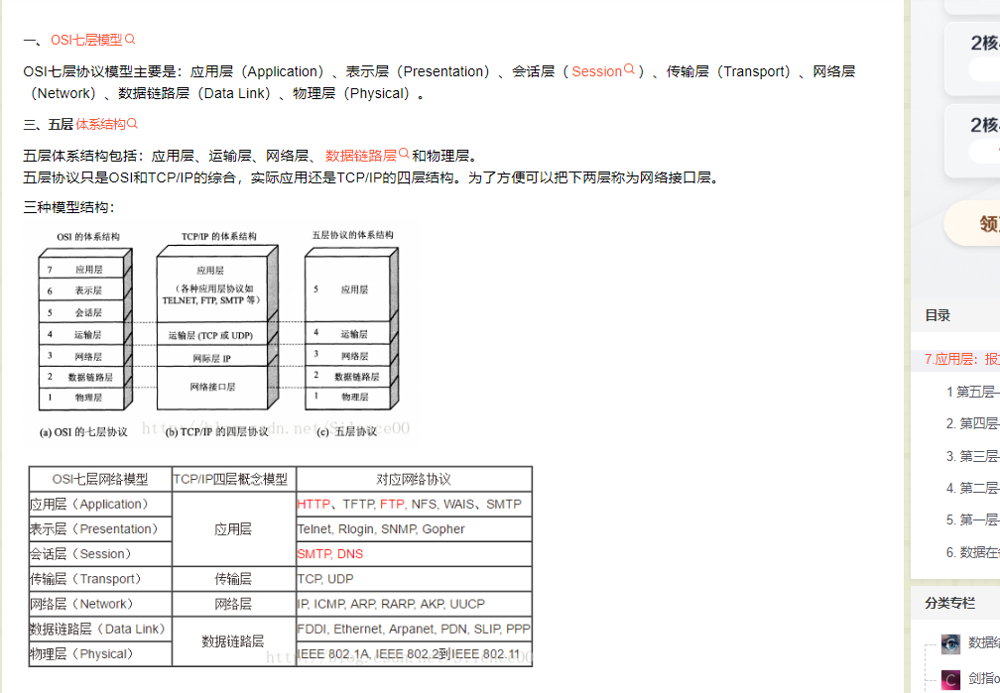
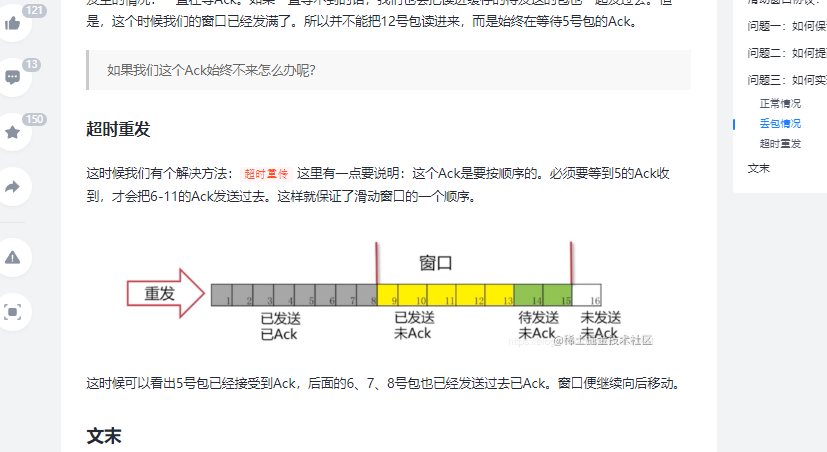
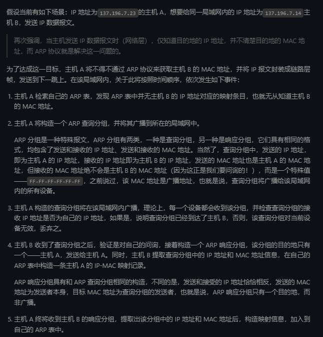
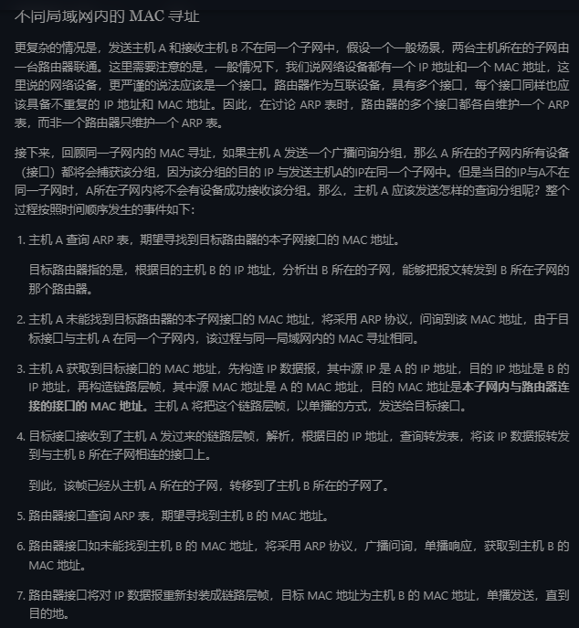

## 1、OSI七层模型
 - 应用层：为应用计算机提供服务。
 - 表示层：数据处理（编解码。加密处理，压缩解压缩）
 - 会话层：管理（建立、维护、重连）应用程序之间的会话
 - 传输层：为两台主机进程之间的通信提供通用的数据传输服务
 - 网络层：路由和寻址（决定数据在网络的游走路径）
 - 数据链路成：（帧编码和误差纠正控制）
 - 物理层：透明地传输比特流输出

 	

## 2 、TCP/IP 协议
1、SYN：同步标识位
2、SCK：确认标识位
3、FIN 完成标识位
4、PSH：推送标识位

## 3、3次握手
 - 1、客户端先发送带有SYN（SEQ=x）标识的数据包给服务端，然后服务端进入SYN-send状态，等待服务器的确认 
 - 2、服务端根据数据包返回SYN+ACK数据包（SEQ=y，ACK=x+1），服务端进入SYS——RECV状态
 - 3、客户端收到信息后，发送带有ACK的数据包（ACK=y+1）-》服务端，然后服务端和客户端都进入ESTABLISHED状态，完成TCP三次握手。 
   
## 4、四次挥手：
 - 1、客户端发送一个FIN（SEQ=x）的数据，进入FIN-WAIT-1状态
 - 2、服务端发送一个ACK（x+1）的数据，此时客户端进入FIN-WAIT-2状态，服务端进入CLOSE-WAIT状态。
 - 3、服务端关闭与客户端的连接，并发送一个FIN（y）数据=》客户端请求关闭连接，服务端进入LAST——ACK状态
 - 4、客户端发送一个ACK（y+1）标识的数据包=》服务端，并进入TIME-WAIT状态，服务端收到数据后没进入CLOSE状态，此时，如果客户端等待2MSL后任然没有回复，就证明服务端已经正常关闭，客户端也就可以关闭连接。

## 5、 HTTPS
 - 非对称加密：交换密钥。 
 - 对称加密：加密数据。
 - 	公钥传输的信赖性：
 		数字签名
 		证书：证书颁发结构（CA）
      
## 6、HTTP状态码
 - 1XX：信息性状态码（接受的请求正在处理）
 - 2XX：成功状体码。请求处理完毕
 - 3XX：重定向状态码。 301 资源被永久重定向 302：资源被临时重定向了。
 - 4XX：客户端错误状态码：服务器无法完成请求。 400BadRequest：参数不合理，请求方法错误。   401:未认证却请求可需要认证的资源 403:直接拒绝http请求，不处理，一般用来针对非法请求 。 404：你请求的资源在服务器为找到。409:Conflict：表示请求的资源与服务器当前的状态存在冲突，请求无法被处理。
 - 5XX：服务器错误状态码：服务器处理请求出错。
	- 500:服务端出问题了。比如程序报错了，但未处理错误。
    - 502:Bad Gateway：我们的请求到服务端了，但是服务端响应的却是一个错误的响应，
	
## 7、TCP滑动窗口？
 - 【参考】https://juejin.cn/post/6844903809995505671
 
 
## 8、TCP报文格式是怎么样的？

## 9、TCP和UDP的区别（重要） 
 - 1、是否面向连接：UDP在传输数据之前不需要先建立连接，而TCP提供面向连接的服务，在传数据之前必须先建立连接。数据传送结束后释放连接。
 - 2、是否可靠传输：远地主机在收到 UDP 报文后，不需要给出任何确认，并且不保证数据不丢失，不保证是否顺序到达。TCP 提供可靠的传输服务，TCP 在传递数据之前，会有三次握手来建立连接，而且在数据传递时，有确认、窗口、重传、拥塞控制机制。通过 TCP 连接传输的数据，无差错、不丢失、不重复、并且按序到达。
%81
 - 3、是否有状态：这个和上面的“是否可靠传输”相对应。TCP 传输是有状态的，这个有状态说的是 TCP 会去记录自己发送消息的状态比如消息是否发送了、是否被接收了等等。为此 ，TCP 需要维持复杂的连接状态表。而 UDP 是无状态服务，简单来说就是不管发出去之后的事情了。
 - 4、传输效率：由于使用 TCP 进行传输的时候多了连接、确认、重传等机制，所以 TCP 的传输效率要比 UDP 低很多。
 - 5、传输形式：TCP 是面向字节流的，UDP 是面向报文的。
 - 6、首部开销：TCP 首部开销（20 ～ 60 字节）比 UDP 首部开销（8 字节）要大。
 - 7、是否提供广播或多播服务：TCP 只支持点对点通信，UDP 支持一对一、一对多、多对一、多对多。

## 10、什么时候选择TCP，什么时候选择UDP？
 - UDP一般用于即时通信，比如：语音、视频、直播等等。这些场景对传输数据的准确性要求不是特别高，比如看视频即使少个一两帧，实际给人的感觉区别不大。
 - TCP用于对传输准确性要求特别高的场景。比如文件下载、发送和接收邮件、远程登录等。
 
## 11、什么是ARP协议？
 - ARP协议是介于网络层和数据链路层之间的协议，换句话说就是ARP协议建立了主机IP地址和MAC地址的映射关系。
 - ARP协议在协议栈中的位置？
	-  ARP 协议在协议栈中的位置非常重要，在理解了它的工作原理之后，也很难说它到底是网络层协议，还是链路层协议，因为它恰恰串联起了网络层和链路层。国外的大部分教程通常将 ARP 协议放在网络层。
 - ARP协议解决了什么问题？
  	-  ARP 协议，全称 地址解析协议（Address Resolution Protocol），它解决的是网络层地址和链路层地址之间的转换问题。因为一个 IP 数据报在物理上传输的过程中，总是需要知道下一跳（物理上的下一个目的地）该去往何处，但 IP 地址属于逻辑地址，而 MAC 地址才是物理地址，ARP 协议解决了 IP 地址转 MAC 地址的一些问题。
 - ARP工作原理？
    - ARP表、广播问询、单播响应。
	- MAC地址是什么：全称是媒体访问地址。 如果说，互联网中每一个资源都由IP地址唯一标识，那么设备都由MAC地址唯一标识。
	- ARP原理分为两个场景讨论？
		- 1、同一个局域网内的MAC寻址。
		  - 
	    - 2、从一个局域网到另一个局域网中的网络设备的寻址。
		  - 		
-----------------
## 12、什么是RIP协议?

## 13、什么是NAT协议？
