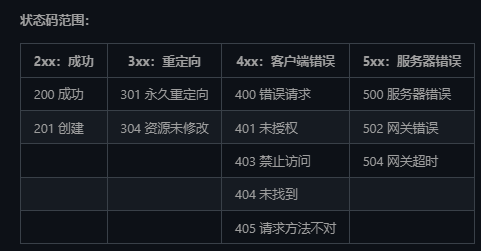

## 1、Java SPI机制
1. Server Provider Interface 服务提供者的接口
 - 例如： SLF4J（Simple Logging Facade for Java）是 Java 的一个日志门面（接口）
 - 实现有 LogBack,Log4j Log4j2

## 2、Java对象的内存布局是什么样子的。
1. 对象头 MarkWord和ClassPointer部分
   1. MarkWord部分记录了一些列的标记为。比如偏向锁、GC信息等。
   2. ClassPointer记录了对象的内存地址信息。
2. Length：数组长度
3. instance data /Array instance 数组对象信息
4. Padding 填充部分、

## 3、泛型和泛型擦除
1. 泛型：类型参数化。把类型明确的工作推迟到对象创建或者调佣方法的时候才去明确的特殊类型。
2. 泛型擦除： 泛型只在编译器中实现而非虚拟机中实现，所以要在虚拟机中进行泛型擦除。也就是说在编译阶段使用泛型，而在运行阶段进行擦除。
3. 泛型的作用
   1. 第一个是泛化。
   2. 第二个是类安全性。
   3. 第三是消除了强制类型转换，减少了出错的机会。
   4. 向后兼容。
4. 泛型的好处
   1. 类安全性。编译器会帮助验证类型假设
   2. 消除了强制类型转换。
   3. 更高的运行效率。
   4. 潜在的性能收益：泛型为较大的优化带来可能。

## 4、Java的三大特性
- 封装
  - 1、设置属性不可以被外部访问，但提供修改和属性值的方法。
  - 2、类的行为和属性看看成是不可分割的一部分。
- 继承
  - 1、子类可以拥有父类的属性和方法。
  - 2、可以操作父类的私有属性，但不能访问私有方法。可以重写父类的方法。
- 多态
  - 一个行为可以具有多个多个表现形式或者形态的能力
  - 方法重载和对象多态两种形式的多态。
    - 1、方法重载：指的是，一个类中可以有相同名称的方法。但入参的类型或者顺序不同。返回类型也可以不同，完成不同的功能。
    - 2、对象多态：父类的引用实现子类的实例。
  - 多态的特点：
    - 1、必须要子类继承某个类。
    - 2、调用了哪个方法，需要在程序运行时才能确定。
    - 3、不能调用在父类中未定义的方法。
    - 4、子类实现了父类的方法，则调用的实际是子类方法，否则调用的是父类的方法。
  - 多态的必要条件
    - 继承
    - 重载
    - 父类的引用指向子类的实例

## 5、Java创建对象的几种方式
- 1、new关键词。
- 2、Class类的newInstance方法。
- 3、Constructor构造方法类的newInstance方法。 .class.getCon
- 4、使用clone方法。
- 5、使用反序列化。ObjectInputStream

## 6、获取Class对象的几种方法？
 - 1、类名.Class
 - 2、实例对象.getClass()
 - 3、Class.forName("类名字符串")
## 6、Object中有哪些方法？
- hashCode
- getClass
- equals
- toString
- clone
- notify
- notifyAll
- wait()
- wait(long timeout)
- wait(long timeout,long nanos)
- finalize()

## 7、Java反射以及优缺点
- Java反射：可以通过反射获取类的所有属性和方法，并执任意一个类的属性和方法。
- 优缺点：
  - 优点：让代码更加灵活，为各种框架提供了便利。
  - 缺点：增加了安全问题：无视泛型参数的安全检查。反射的性能也比较差。
    
## 8、序列化和反序列化？
 - 序列化：将数据结构或者对象转换成二进制字节流的过程。
 - 反序列化：将在序列化过程中生成的二进制字节流转换成数据结构或者对象的过程。

## 8、何谓注解。
- 用于修饰类、方法、变量。在程序编译期间或者运行期间提供某些信息。
- 编译器直接扫描：eg@Override 。运行期间通过发射获取。

## 9、抽象类和接口的区别
- 相同点
1. 都可以用抽象方法。
2. 都可以有默认的实现方法。
3. 都不能被实例化
- 不同点
1. 接口是对类行为的定义，或者只是一个表示，用于定义类有那些行为，实现类必须实现这些行为。而抽象类一般用于代码复用
2. 一个类可以实现多个接口但只能继承一个类。
3. 接口的成员变量是public static final类型的，且必须有初始值。而抽象类成员变量默认是default，可以在子类重新定义，也可以重新赋值。

## 10、进程和线程
1. 进程：
   进程：程序的一次执行过程，系统运行程序的基本单位。
   线程：和进程类似，是比进程更小的运行单位，一个进程运行时可以有多个线程。不同的是，进程可以共享队和方法区，且有自己私有的空间，

## 11、==和equals的区别
 - == 比较的是对线内存地址或者基本变量的值是否相等。  equals比较的是对象的值是否相等。

## 11、hashCode()有什么用？
 - hashCode的作用是获取hash码。也称散列码
 - 在一些容器中，判断元素是否在容器中的效率会更高。
 - hashCode和equals的关系
  - hashCode相等的两个对象，equals不一定相等。
  - equals相等的 hashCode就一定相等。
  - hashCode不相等，则equals一定不相等。
## 12、为什么重写equals一定要重写 hashCode方法？
 - 如果补充些hashCode方式会导致，equals相等，但hashCode不相等的情况

## 12 String、StringBuilder、StringBuffer三者的区别？ 
 - String不可变
    - 为什么比可变？
        - 保存字符串的数组识别final修饰的。且没有提供修改这个数组的方法
        - String是被final修饰的
 - StringBuilder 可变。线程不安全。效率高
 - StringBuffer 可变，线程安全，效率低

## 13、字符串拼接？
  - “+” 可以看出，字符串对象通过“+”的字符串拼接方式，实际上是通过 StringBuilder 调用 append() 方法实现的，拼接完成之后调用 toString() 得到一个 String 对象 。 

## 14、String s1 = new String("abc") 这句话会创建几个对象？
 - 会创建1-2个对象。
      - 1、首先判断“abc”在字符串常量池中是否存在，如果存在的话就直接返回引用地址。不存在的话先创建再返回引用地址。 
      - 2、在堆中创建对象。指向abc。
      - 3、将对象地址返回复制给s1。

## 10、 JVM虚拟机
1. JVM内存分区
   - 程序计数器：可以看作是当前程序所执行的字节码的行号指示器。
     - 1、记录字节码指令的行号。字节码解释器，通过改变程序计数器来一次读取指令。从而达到控制代码流程的作用。顺序执行、选择、循环、异常捕获等。
     - 2、多线程运行时，记录下当前运行到的指令为止，下一次线程切换回来的时候能够继续运行。
   - 虚拟机栈：操作数栈、局部变量表、动态链接、方法返回地址。
   - 本地方法栈：
   - 堆 ：存放对象
   - 方法区 ：类信息、常量、静态变量

## 11、多线程的优点和缺点
- 优点：提高单个cpu和IO系统的效率；多核时代：充分利用多核cpu的能力。
- 缺点：线程不安全问题、内存泄露、死锁。
- 线程不安全问题：同一份数据，是否报数据正确性和一致性。是否有数据混乱、错误或者丢失。

## 12、 线程的状态
1. NEW
2. Runnable状态，调用start ，等待运行状态。 ready状态，获取cpu时间片后就是running状态。
3. Blocking 阻塞状态
4. WAITING 等待状态
5. timeWaiting 超时等待状态
6. Terminated 终止状态。

## 13、线程死锁的四大条件
- 什么是死锁：多个线程同时被阻塞，他们中的一个或者多个全部都在等待某个资源被释放。由于线程无线的被阻塞，因此程序不可能正常运行。
1. 互斥条件：一个资源同一时间内只能被一个线程所占用
2. 请求与保持条件：一个线程在请求某个资源而阻塞时，对已经获取的资源不会释放
3. 不剥夺条件：某个线程获取的资源，被能被其他线程强行剥夺，只能由自己释放
4. 循环等待：多个线程和资源之间形成首尾相连的请求和依赖关系

## 14、wait方法和sleep方法的区别
- wait方法释放锁，sleep方法不会
- wait用于线程间通信，sleep用于暂停执行
- wait方法线程不会主动苏醒，需要系统调用notify方法或者notifyAll，sleep可以，wait（long）可以
- sleep是Thread的静态方法，wait是Object中定义的方法。

## 15、volatile关键词
1. 保证变量的可见性
2. 禁止指令重排序。 （new 对象 1、给对象分配内存空间 2、初始化 3、将对象直线引用地址）

## 16、悲观锁和乐观锁
- 悲观锁：以最坏的情况考虑问题，每次访问资源的时候都有可能产生问题，每次访问资源都需要进行锁操作
- 乐观锁：以最好的情况考虑问题，每次访问的时候不会存在问题，只有在提交修改的时候去验证，资源是否已经被其他资源修改过了。

## 17、实现乐观锁：、
 -1、版本号机制 2、CAS算法。

## 18、CAS算法怎么实现的。
- 1、E 一个预期值
- 2、V 要更新的变量值
- 3、N 拟写入的新值

## 19、synchronized关键词：保证同一个时间内，是有一个线程能够访问代码块或者方法
- 1、修饰实例方法（锁当前对象）
- 2、修饰静态方法（锁当前类）
- 3、修饰代码块（？？任意）

## 20、synchronized和reenTrantLock区别和共同点
- 1、都是可重入锁
- 2、reenTrantLock可以实现公平锁
- 3、reenTrantLock的高级功能：
  - 等待可中断
  - 可实现公平锁
  - 可实现选择性通知。需要借助于Condition接口和newCondition()方法
- 4、synchronized依赖于JVM，而reenTrantLock依赖于API
    
### 1、synchronized的实现原理？
 - 同步代代码块：底层依赖JVM完成，同步代码块的语义底层通过一个monitor对象来完成的。其实watit。、notify等方法也依赖于monitor对象。
    - monitorenter命令：每个对象都是一个监视器锁（monitor）。当monitor被占用是就处于锁定状态，线程执行monitorenter命令尝试获取monitorenter的所有权。过程如下：
        - 1、如果monitor的进入数为0，则该线程进入monitor，然后将进入数设置为1.该线程即为monitor的所有者。
        - 2 如果线程已经占有monitor，只是重新进入，则进入monitor的进入数加1.
        - 3、如果其他线程已经占用monitor，则该线程进入阻塞状态，知道monitor进入数为0，再重新尝试获取monitor的所有权。
    - monitorexit命令： ：执行monitorexit的线程必须是objectref所对应的monitor的所有者。指令执行时，monitor的进入数减1，如果减1后进入数为0，那线程退出monitor，不再是这个monitor的所有者。其他被这个monitor阻塞的线程可以尝试去获取这个 monitor 的所有权。monitorexit指令出现了两次，第1次为同步正常退出释放锁；第2次为发生异步退出释放锁；。
 - 同步方法：  方法的同步通过ACC_SYNCHRONIZED 标示符。JVM就是根据该标识付来实现同步方法的。当方方法调用时，调佣指令会检查方法的ACC_SYNCHRONIZED访问标识是否被设置，如果设置了，执执行线程将先获取monitor，获取成功之后才能执行方法体，方法执行后再释放monitor。在方法执行期间。其他线程都无法获取同一个monitor独对象。

### 2、reenTrantLock的实现原理？

## 21、ThreadLocal
- 每个Thread拥有一个threadLocalMap类存储 。key是ThreadLocal变量，而value是值。 key是弱引用，value是强引用。

## 22、线程池的好处
- 1、降低资源消耗
- 2、提高响应速度
- 3、提高线程的可管理性
### 1、线程池的实现原理？
 - 1、JVM先根据用户给定的参数创建一定数量的可运行的线程任务，并将其放入队列中，在线程创建后启动这些任务，如果正在运行的线程数量超过了最大线程数量(用户设置的线程池大小)，则超出数量的线程排队等候，在有任务执行完毕后，线程池调度器会发现有可用的线程，进而再次从队列中取出任务并执行。
### 2、线程池线程的计算方式。
 - 根据计算方式是计算密集型还是IO密集型。
 - 2、Nthreads = Ncpu x Ucpu x(1 + W/C)
    - W 线程等待时间。
    - C 线程计算时间。
    - Ucpu CPU使用率。
  

## 23、线程池的参数
1. coolPoolSize：任务队列未达到队列容量是，最大可同时运行的线程数量
2. maxPoolSize：任务队列达到队列容量时候，最大可同时运行的线程数量
3. workQueue：判断当前同时运行的线程数量是否达到了核心线程数，如果达到了，则将任务存放在该队列中。
4. keepAliveTime：
5. unit
6. ThreadFactory
7. handle：拒绝策略

## 24、JMM java内存模型：抽象了线程和主内存之间的关系。
- JMM是什么：Java定义的并发编程的一组规范，除了抽象线程和主内存之间的关系之外，其还规定了从Java代码到CPU可执行命令的这个转换过程要遵守哪些和并发相关的原则和规范。
- 主内存：所有线程创建的实例对象都存放在主内存中，不管是实例对象的成员变量还是方法中的局部变量
- 本地内存：每个线程都有一个私有的本地内存来保存共享变量的副本。每个线程都有自己的本地内存，无法访问其他线程的本地内存。

## 25、happen-before原则：
- 为了对编译器和处理器的约束尽可能少，只要不改变程序执行结果，编译器和处理起怎么进行重新排序优化都行。
- 对于改变程序执行结果的重排序，JMM要求编译器和处理器都禁止这种重排序。
- happen-before八大原则：
  - 1、程序次序规则：在一个线程内，按照控制流程，书写在前面的操作先行发生在发生在后面的操作。
  - 2、管制锁定规则：一个unlock操作先行发生于后面的锁的lock操作。这里必须强调的是“同一个锁”，而“后面”是指时间上的先后。
  - 3、volatile 变量规则：对于一个volatile修饰的变量的写操作优先于发生于后面对这个变量的读操作。
  - 4、线程启动规则：Thread对象的start方法发生于此线程的每个动作之前。
  - 5、线程终止规则：线程中的所有操作都先行发生于对此线程的终止检测。
  - 6、线程中断规则：对线程的interrupt()方法的调用先行发生于被中断线程的代码检测到中断事件的发生。通过interrupted()方法检测是否有中断发生。
  - 7、对象终结规则：一个对象的初始化完成先行于他的finalize()方法。
  - 8、传递性：如果A先行发生于B，B先行发生于C，那么就可以得到A先行发生于C的结论。
- as-if-serial：不管怎么重新排序，单线程环境下的执行结果不能改变。

## 26、并发编程的三个特性：
- 原子性
- 可见性
- 有序性

## 27、常见的IO模型
- 1. BIO 同步阻塞 ：同步阻塞模型中，应用程序发起read调用后，会一直阻塞，直到内核数据拷贝到用户空间。
- 2. NIO none-blocking IO /NEW-IO？？非阻塞同步？？（可以看作是IO多路复用模型）：NIO 于 Java 1.4 中引入，对应 java.nio 包，提供了 Channel , Selector，Buffer 等抽象。NIO 中的 N 可以理解为 Non-blocking，不单纯是 New。它是支持面向缓冲的，基于通道的 I/O 操作方法。 对于高负载、高并发的（网络）应用，应使用 NIO
  - NIO采用通道和缓冲去对文件进行操作，以及用socketChannel和ServerSocketChannel进行网络传输。
  - 传统的IO采用阻塞式模型，对于每个连接，都需要创建一个独立的线程来处理读写操。当一个线程等待IO操作时，无法执行其他任务。会导致大量的线程创建和销毁，以及上下文切换，降低了系统性能。NIO使用IO多路复用模型，允许线程在等待IO时执行其他任务。这种模式通过选择器（Selector）来监控多个通道（Channel）上的I/O事件，实现了更高的性能和可伸缩性。
- 3. AIO(NIO2) 异步非阻塞的IO。异步IO是基于事件和回调机制实现的，也就是应用操作之后不会直接返回，不会阻塞那里，当后台处理完成之后，操作系统会通知相应的线程进行后续的操作。
- 4. IO和NIO的区别：
  - 可以简单认为IO是面向流的，NIO是面向块的。（缓冲区）处理
  - 面向流的I/O系统一次一个字节的处理数据
  - 面向块的I/O系统以块的形式处理数据。

## 28、IO
- IO即Input/Output，输入和输出。数据输入到计算机内存的过程即输入，计算机内存输出到外部存储（比如数据库、文件、远程主机）的过程即输出。
- IO流在Java中分为输入流和输出流，而根据数据的处理方式又分为字节流和字符流。
- Java的IO是从四类基础类中派生出来的：
  - InputStream/Reader：所有的输入流的基类，前者是字节字节流，后者是字符输入流。
  - OutputStream/Writer：所有的输出流的基类，前者是字节流，后者是字符流。
- 缓冲流：
  - 字节缓冲流：IO操作是很消耗内存的，缓冲流将数据加载到缓冲去，一次性读取/写入多个字节，从而避免频繁的IO操作，从而提高流的传输效率。字节缓冲流通过装饰器模式增加（InputStream/OutPutStream）子类对象的功能。
  - 字符缓冲流：类似于字节缓冲流，内部都维护一个字节数组作为缓冲。字符缓冲流主要用来操作字符。

## 29、JavaIO的设计模式
1. 装饰器模式
- 装饰器模式：可以在改变原有对象的基础上，增强器功能。
- 对于字节流来说，FilterInputStream 和FilterOutputStream是装饰器模式的核心，分别用于增加InputStream和OutputStream子类对象的功能。
2. 适配器模式
   - 适配器模式：主要用于互补兼容的接口的协调工作。
   - 适配者：适配者模式中被适配的对象称之为适配者，作用于适配者之间的被称为适配器。
   - 适配器：适配器分为对象适配器和类适配器。类适配器使用继承关系来实现，对象适配器使用组合关系来实现。
3. 工厂模式：NIO中。
4. 观察者模式：NIO中的文件监听属于观察者模式。

## 29、类加载过程
- 加载：
  - 1、通过全类名获取定义此类的二进制字节流。
  - 2、将字节流所代表的静态储存结构转换为方法区的运行时数据结构。
  - 3、在内存中生成一个代表该类的Class对象，作为方法区这些数据的访问入口。
- 验证：
  - 1、文件格式验证（Class文件格式检查）
  - 2、元数据验证（字节码语义检查）
  - 3、字节码验证（程序语义检查）
  - 4、符号引用验证 （类的正确性检查）
- 准备： 准备阶段是正式为类变量分配内存并设置初始值的阶段。	这些内存都在方法区中分配。
  - 1. 这些类变量只包括类的静态成员变量，而不包括实例变量。
  - 2. 字符串变量在1.7之后被移动放在堆中。
  - 3. 这里的初始值通常情况下指的是数据类型的零值。
- 解析：解析接待是程序将常量池内的符号引用替换为直接引用的过程。解析动作主要针对 类或、接口、字段、类方法、接口方法、方法类型、方法句柄和调用限定符等7种符号引用。
- 初始化：是执行类初始化方法的<clinit> ()方法的过程，是类加载的最后一步。这一步JVM才真正开始执行类中定义的Java程序代码。

- 三个必要条件:
  - 该类的所有对象是实例被回收。
  - 该类没有在其他地方被引用。
  - 该类的类加载器被GC。

## 31、Java堆空间和内存回收原则
### 1. 堆空间的基本结构
- 新生代
- 老年代
- 永久带(Java1.8之后用元空间取代)
### 2. 内存分配和回收原则
   - 对象首先在Eden区分配
   - 大对象直接进入老年代（需要大量连续内存空间的对象，例如：字符串、数组等）
   - 长期存活的对象进入老年带
### 3. 死亡对象的判断
   - 引用计数法：给对象添加一个引用计数器
     - 每当有一个地方引用对象，计数器就加1.
     - 当引用失效，计数器就减少1
     - 任何时候计数器为0的对象就是不可能再被使用的。
     - 这个方法实现简单，效率高，但是目前虚拟机中没有选择这个算法管理内存，因为它很难解决对象之间循环引用的问题。
   - 可达性分析算法：这个算法的基本思路就是通过一系列称为“GC Roots”的对象作为起点，从这些起点开始向下搜索，节点所走过的路径被称为引用链，当一个对象到GC-Roots没有任何引用链的话，则证明此对象是不可用的，需要被回收
### 4. 垃圾收集算法：
   - 标记-清除算法：标记清除算法，分为标记和清除两个阶段，首先标记可达对象，然后清除
     - 问题：1、效率：标记和清除效率都不高 2、空间问题：会产生很多不连续的空间
   - 复制算法：可以将内存分为大小相同的两块，每次使用其中的一块，当这一块使用完成之后，就将存活的对象复制到另一块去，然后把使用的空间一次清理。
   - 标记-整理算法：
   - 分代收集算法
### 5. 几种GC的意思？
 - MinorGC 年轻代GC MajorGC oldGC或者FullGC。 FullGC：收集整个堆
    
## 32、偏向锁、轻量级锁、重量级锁。
 - 1、首先清楚Java对象头中的数据结构。
    - 1、MarkWord：用于存储对象自身的运行数据。如 HashCode、GC分代年龄、锁状态标志、线程持有的锁、偏向线程ID等等。
    - 2、类型指针：虚拟机通过这个指针确定该对象是哪个类的实例。
    - 3、数组长度
    - 4、对齐填充部分。
 - MarkWord：不同锁的存储信息。
     - 无锁： 25bit HashCode + 4 bit对象分代年龄。 1 bit（是否是偏向锁） 2 bit（锁标志位）01
     - 偏向锁 ：23bit线程ID 2bit epoch 4bit对象分代年龄 1bit是否是偏向锁  2bit（锁标志位） 01 （cas替换线程ID）
     - 轻量级锁：30bit指向 线程栈锁记录的指针。 2bit锁标识位 00  （cas替换线程栈记录指针）
     - 重量级锁：指向锁监视器的指正。 2bit锁标识位 10
- 参考 【https://www.cnblogs.com/wuqinglong/p/9945618.html】

## 32、RESTful API是什么？
 - RESTful API 可以让你看到 URL+Http Method 就知道这个 URL 是干什么的，让你看到了 HTTP 状态码（status code）就知道请求结果如何。
 - “资源”在网络传输中以某种“表现形式”进行“状态转移”
 - 几个概念：
    - 资源：我们可以把真实的对象数据称为资源。一个资源既可以是一个集合，也可以是单个个体。
    - 表现形式："资源"是一种信息实体，它可以有多种外在表现形式。我们把"资源"具体呈现出来的形式比如 json，xml，image,txt 等等叫做它的"表现层/表现形式"。
    - 状态转移：REST 中的状态转移更多地描述的服务器端资源的状态，比如你通过增删改查（通过 HTTP 动词实现）引起资源状态的改变。
 - 总结：
    - 1、每一个 URI 代表一种资源；
    - 2、客户端和服务器之间，传递这种资源的某种表现形式比如 json，xml，image,txt 等等；
    - 3、客户端通过特定的 HTTP 动词，对服务器端资源进行操作，实现"表现层状态转化"
### 1、RESTful API规范
 - 动作：
    - GET: 请求从服务器获取特定资源。举个例子：GET /classes（获取所有班级）
    - POST: 在服务器上创建一个新的资源。举个例子：POST /classes（创建班级）
    - PUT: 更新服务器上的资源（客户端提供更新后的整个资源）。举个例子：PUT /classes/12（更新编号为 12 的班级）
    - DELETE: 从服务器删除特定的资源。举个例子：DELETE /classes/12（删除编号为 12 的班级）
    - PATCH: 更新服务器上的资源（客户端提供更改的属性，可以看做作是部分更新），使用的比较少，这里就不举例子了。
 - 路径（接口命名）
  - 1、网址中不能有动词，只能有名词，API 中的名词也应该使用复数。 因为 REST 中的资源往往和数据库中的表对应，而数据库中的表都是同种记录的"集合"（collection）。如果 API 调用并不涉及资源（如计算，翻译等操作）的话，可以用动词。
  - 2、 不用大写字母，建议用中杠 - 不用下杠 _ 。
  - 3、善用版本化 API。
  - 4、接口尽量使用名词，避免使用动词。
 - 过滤信息：如果我们在查询的时候需要添加特定条件的话，建议使用 url 参数的形式。
 - 状态码
 

## 33、JWT是什么？
 - JWT （JSON Web Token） 是目前最流行的跨域认证解决方案，是一种基于 Token 的认证授权机制。 从 JWT 的全称可以看出，JWT 本身也是 Token，一种规范化之后的 JSON 结构的 Token。
 - JWT 自身包含了身份验证所需要的所有信息，因此，我们的服务器不需要存储 Session 信息。这显然增加了系统的可用性和伸缩性，大大减轻了服务端的压力。
 - JWT由哪些部分组成？
  - JWT 本质上就是一组字串，通过（.）切分成三个为 Base64 编码的部分：
     - Header：描述JWT的元数据，定义了生成签名的算法以及Token的类型。
     - PayLoad：用来存放实际需要传递的数据
     - Signature（签名）：服务器通过 Payload、Header 和一个密钥(Secret)使用 Header 里面指定的签名算法（默认是 HMAC SHA256）生成。
        - 【参考文档：https://javaguide.cn/system-design/security/jwt-intro.html#jwt-%E7%94%B1%E5%93%AA%E4%BA%9B%E9%83%A8%E5%88%86%E7%BB%84%E6%88%90】
    
## 34、JWT的优缺点？
 - 优势：
    - 无状态
    - 有效避免了CSRF攻击
    - 适合移动端
    - 单点登入友好
 【参考文献：https://javaguide.cn/system-design/security/advantages-and-disadvantages-of-jwt.html】
      
## 35、SSO单点登入？？
 【参考文献：https://javaguide.cn/system-design/security/sso-intro.html#%E8%B7%A8%E5%9F%9F%E7%99%BB%E5%BD%95%E3%80%81%E7%99%BB%E5%87%BA】：    

## 36、垃圾收集器？
 - Serial 收集器
 - ParNew 收集器
 - Parallel Scavenge 收集器
   - Parallel Scavenge 收集器关注点是吞吐量（高效率的利用 CPU）。CMS 等垃圾收集器的关注点更多的是用户线程的停顿时间（提高用户体验）。所谓吞吐量就是 CPU 中用于运行用户代码的时间与 CPU 总消耗时间的比值。 Parallel Scavenge 收集器提供了很多参数供用户找到最合适的停顿时间或最大吞吐量，如果对于收集器运作不太了解，手工优化存在困难的时候，使用 Parallel Scavenge 收集器配合自适应调节策略，把内存管理优化交给虚拟机去完成也是一个不错的选择。
   - 新生代采用复制算法。老年代采用标记-整理算法 
 - Serial Old收集器
 - Parallel Old收集器
 - CMS收集器
 - G1收集器
 - ZGC收集器

## 37、JUC是什么？
 - JUC是 在Java 5.0添加的 java.util.concurrent包的简称，目的就是为了更好的支持高并发任务， 让开发者利用这个包进行的多线程编程时可以有效的减少竞争条件和死锁线程。
 - JUC的5个部分：
    - 1、tools：CountDownLatch（闭锁）、Semaphore（信号量）、CyclicBarrier（栅栏）
    - 2、locks：
    - 3、executor:
    - 4、Collections：主要是提供线程安全的集合
    - 5、Atomic: 是JDK提供的一组原子操作类，

## 38、AQS介绍和原理？
 - AQS介绍：AQS 的全称为 AbstractQueuedSynchronizer ，翻译过来的意思就是抽象队列同步器。这个类在 java.util.concurrent.locks 包下面。
 - AQS就是一个抽象类，用于构建锁和同步器。
 - AQS的核心思想：如果被请求的共享资源空闲，则将当前请求资源的线程设置为有效的工作线程，并且将共享资源设置为锁定状态。如果被请求的共享资源被占用，那么就需要一套线程阻塞等待以及被唤醒时锁分配的机制，这个机制 AQS 是基于 CLH 锁 （Craig, Landin, and Hagersten locks） 实现的。
 - CLH锁：CLH 锁数据结构很简单，类似一个链表队列，所有请求获取锁的线程会排列在链表队列中，自旋访问队列中前一个节点的状态。当一个节点释放锁时，只有它的后一个节点才可以得到锁。CLH 锁本身有一个队尾指针 Tail，它是一个原子变量，指向队列最末端的 CLH 节点。每一个 CLH 节点有两个属性：所代表的线程和标识是否持有锁的状态变量。当一个线程要获取锁时，它会对 Tail 进行一个 getAndSet 的原子操作。该操作会返回 Tail 当前指向的节点，也就是当前队尾节点，然后使 Tail 指向这个线程对应的 CLH 节点，成为新的队尾节点。入队成功后，该线程会轮询上一个队尾节点的状态变量，当上一个节点释放锁后，它将得到这个锁。
 - CLH锁作为自旋锁的改进，有以下几个优点：
    - 1、性能优异
    - 2、公平锁
    - 3、实现简单、易于理解 
    - 4、扩展性强
    - 缺点： 1、因为有自旋操作，当锁持有时间长时会带来比较大的CPU开销 
    - 2、CLH锁的功能单一，不改造不能支持复杂的功能。
 - AQS对CLH队列的改进
  - 1、扩展每个节点的状态 volatile int waitStatus
    - AQS 同样提供了该状态变量的原子读写操作，但和同步器状态不同的是，节点状态在 AQS 中被清晰的定义，如下表所示：
        - SIGNAL：表示该节点正常等待
        - PROPAGATE：应将releaseShared传播到其他节点。
        - CONDITION：该节点位于条件队列，不能用于同步队列节点
        - CANCELLED：由于超时、中断或其他原因，该节点被取消
  - 2、显示地维护前驱节点和后驱节点
    - 上文我们提到在原始版本的 CLH 锁中，节点间甚至都没有互相链接。但是，通过在节点中显式地维护前驱节点，CLH 锁就可以处理“超时”和各种形式的“取消”：如果一个节点的前驱节点取消了，这个节点就可以滑动去使用前面一个节点的状态字段。
    - 因为 AQS 用阻塞等待替换了自旋操作，线程会阻塞等待锁的释放，不能主动感知到前驱节点状态变化的信息。AQS 中显式的维护前驱节点和后继节点，需要释放锁的节点会显式通知下一个节点解除阻塞，如下图所示，T1 释放锁后主动唤醒 T2，使 T2 检测到锁已释放，获取锁成功。
  - 3、辅助 GC
    - JVM 的垃圾回收机制使开发者无需手动释放对象。但在 AQS 中需要在释放锁时显式的设置为 null，避免引用的残留，辅助垃圾回收。
    
## 39、AQS资源共享方式？
 - AQS定了两种资源共享的方式：Exclusive（独占，只有一个线程能执行，入ReentrantLock）和Share（共享，多个线程可同时执行，入Semaphore/CountDownLatch）  
 - 一般来说，自定义同步器的共享方式要么是独占，要么是共享，他们也只需实现tryAcquire-tryRelease、tryAcquireShared-tryReleaseShared中的一种即可。但 AQS 也支持自定义同步器同时实现独占和共享两种方式，如ReentrantReadWriteLock。

## 40、AQS自定以同步器？
 - 同步器的设计是基于模板方法模式的，如果需要自定义同步器一般的方式是这样
  - 使用者继承 AbstractQueuedSynchronizer 并重写指定的方法。
  - 将 AQS 组合在自定义同步组件的实现中，并调用其模板方法，而这些模板方法会调用使用者重写的方法。