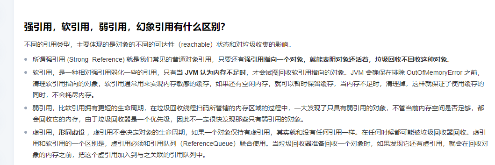

## 1、Java SPI机制

1. Server Provider Interface 服务提供者的接口

- 例如： SLF4J（Simple Logging Facade for Java）是 Java 的一个日志门面（接口）
- 实现有 LogBack,Log4j Log4j2

## 2、Java对象的内存布局是什么样子的。

1. 对象头 MarkWord和ClassPointer部分
   1. MarkWord部分记录了一些列的标记为。比如偏向锁、GC信息等
   2. ClassPointer记录了对象的内存地址信息
2. Length：数组长度
3. instance data /Array instance 数组对象信息
4. Padding 填充部分

## 3、泛型和泛型擦除？

1. 泛型：类型参数化。把类型明确的工作推迟到对象创建或者调佣方法的时候才去明确的特殊类型。
2. 泛型擦除： 泛型只在编译器中实现而非虚拟机中实现，所以要在虚拟机中进行泛型擦除。也就是说在编译阶段使用泛型，而在运行阶段进行擦除。
3. 泛型的作用
  1. 第一个是泛化。
  2. 第二个是类安全性。
  3. 第三是消除了强制类型转换，减少了出错的机会。
  4. 向后兼容。
4. 泛型的好处
  1. 类安全性。编译器会帮助验证类型假设
  2. 消除了强制类型转换。
  3. 更高的运行效率。
  4. 潜在的性能收益：泛型为较大的优化带来可能。

## 4、Java的三大特性？

 - 封装
  - 1、设置属性不可以被外部访问，但提供修改和属性值的方法。
  - 2、类的行为和属性看看成是不可分割的一部分。
 - 继承
  - 1、子类可以拥有父类的属性和方法。
  - 2、可以操作父类的私有属性，但不能访问私有方法。可以重写父类的方法。
- 多态
  - 一个行为可以具有多个多个表现形式或者形态的能力
  - 方法重载和对象多态两种形式的多态。
    - 1、方法重载：指的是，一个类中可以有相同名称的方法。但入参的类型或者顺序不同。返回类型也可以不同，完成不同的功能。
    - 2、对象多态：父类的引用实现子类的实例。
  - 多态的特点：
    - 1、必须要子类继承某个类。
    - 2、调用了哪个方法，需要在程序运行时才能确定。
    - 3、不能调用在父类中未定义的方法。
    - 4、子类实现了父类的方法，则调用的实际是子类方法，否则调用的是父类的方法。
  - 多态的必要条件
    - 继承
    - 重载
    - 父类的引用指向子类的实例

## 5、Java创建对象的几种方式

 - 1、new关键词。
 - 2、Class类的newInstance方法。
 - 3、Constructor构造方法类的newInstance方法。 .class.getCon
 - 4、使用clone方法。
 - 5、使用反序列化。ObjectInputStream

## 6、获取Class对象的几种方法？
 - 1、类名.Class
 - 2、实例对象.getClass()
 - 3、Class.forName("类名字符串")

## 6、Object中有哪些方法？
 - hashCode
 - getClass
 - equals
 - toString
 - clone
 - notify
 - notifyAll
 - wait()
 - wait(long timeout)
- wait(long timeout,long nanos)
- finalize()

## 7、Java反射以及优缺点

 - Java反射：可以通过反射获取类的所有属性和方法，并执任意一个类的属性和方法。
 - 优缺点：
  - 优点：让代码更加灵活，为各种框架提供了便利。
  - 缺点：增加了安全问题：无视泛型参数的安全检查。反射的性能也比较差。

## 8、序列化和反序列化？
 - 序列化：将数据结构或者对象转换成二进制字节流的过程。
 - 反序列化：将在序列化过程中生成的二进制字节流转换成数据结构或者对象的过程。

### 8.1 序列化接口Serializable？
 - Serializable是java.io包中定义的、用于实现Java类的序列化操作而提供的一个语义级别的接口。

### 8.2 序列化serialVersionUID？
 - JAVA序列化的机制是通过判断类的serialVersionUID来验证版本是否一致的。在进行反序列化时，JVM会把传来的字节流中的serialVersionUID和本地相应实体类的serialVersionUID进行比较，如果相同，反序列化成功，如果不相同，就抛出InvalidClassException异常。
 - 如果没有指定serialVersionUID，序列化运行时将基于类的各个方面计算该类的默认serialVersionIUID。

## 8、何谓注解。

 - 用于修饰类、方法、变量。在程序编译期间或者运行期间提供某些信息。
 - 编译器直接扫描：eg@Override 。运行期间通过发射获取。

## 9、抽象类和接口的区别

 - 相同点

1. 都可以用抽象方法。
2. 都可以有默认的实现方法。
3. 都不能被实例化

 - 不同点

1. 接口是对类行为的定义，或者只是一个表示，用于定义类有那些行为，实现类必须实现这些行为。而抽象类一般用于代码复用
2. 一个类可以实现多个接口但只能继承一个类。
3. 接口的成员变量是public static final类型的，且必须有初始值。而抽象类成员变量默认是default，可以在子类重新定义，也可以重新赋值。

## 10、进程和线程

1. 进程：
   进程：程序的一次执行过程，系统运行程序的基本单位。
   线程：和进程类似，是比进程更小的运行单位，一个进程运行时可以有多个线程。不同的是，进程可以共享队和方法区，且有自己私有的空间，

## 11、==和equals的区别
 - == 比较的是对线内存地址或者基本变量的值是否相等。  equals比较的是对象的值是否相等。

## 11、hashCode()有什么用？

 - hashCode的作用是获取hash码。也称散列码
 - 在一些容器中，判断元素是否在容器中的效率会更高
 - hashCode和equals的关系
 - hashCode相等的两个对象，equals不一定相等
 - equals相等的 hashCode就一定相等
 - hashCode不相等，则equals一定不相等

## 12、为什么重写equals一定要重写 hashCode方法？

 - 如果补充些hashCode方式会导致，equals相等，但hashCode不相等的情况

## 12、String、StringBuilder、StringBuffer三者的区别？

 - String不可变
  - 为什么比可变？
    - 保存字符串的数组识别final修饰的。且没有提供修改这个数组的方法
    - String是被final修饰的
 - StringBuilder 可变。线程不安全。效率高
 - StringBuffer 可变，线程安全，效率低

## 13、字符串拼接？

 - “+” 可以看出，字符串对象通过“+”的字符串拼接方式，实际上是通过 StringBuilder 调用 append() 方法实现的，拼接完成之后调用 toString() 得到一个 String 对象 。

## 14、String s1 = new String("abc") 这句话会创建几个对象？

 - 会创建 1-2 个对象。
  - 1、首先判断“abc”在字符串常量池中是否存在，如果存在的话就直接返回引用地址。不存在的话先创建再返回引用地址。
  - 2、在堆中创建对象。指向abc。
  - 3、将对象地址返回复制给s1。

## 10、 JVM虚拟机

1. JVM内存分区
   - 程序计数器：可以看作是当前程序所执行的字节码的行号指示器。
     - 1、记录字节码指令的行号。字节码解释器，通过改变程序计数器来一次读取指令。从而达到控制代码流程的作用。顺序执行、选择、循环、异常捕获等。
     - 2、多线程运行时，记录下当前运行到的指令为止，下一次线程切换回来的时候能够继续运行。
   - 虚拟机栈：操作数栈、局部变量表、动态链接、方法返回地址。
   - 本地方法栈：
   - 堆 ：存放对象
   - 方法区 ：类信息、常量、静态变量

## 27、常见的IO模型有哪些？

 - 1. BIO 同步阻塞 ：同步阻=塞模型中，应用程序发起read调用后，会一直阻塞，直到内核数据拷贝到用户空间。
 - 2. NIO none-blocking IO /NEW-IO？？非阻塞同步？？（可以看作是IO多路复用模型）：NIO 于 Java 1.4 中引入，对应 java.nio 包，提供了 Channel , Selector，Buffer 等抽象。NIO 中的 N 可以理解为 Non-blocking，不单纯是 New。它是支持面向缓冲的，基于通道的 I/O 操作方法。 对于高负载、高并发的（网络）应用，应使用 NIO

  - NIO采用通道和缓冲去对文件进行操作，以及用socketChannel和ServerSocketChannel进行网络传输。
  - 传统的IO采用阻塞式模型，对于每个连接，都需要创建一个独立的线程来处理读写操。当一个线程等待IO操作时，无法执行其他任务。会导致大量的线程创建和销毁，以及上下文切换，降低了系统性能。NIO使用IO多路复用模型，允许线程在等待IO时执行其他任务。这种模式通过选择器（Selector）来监控多个通道（Channel）上的I/O事件，实现了更高的性能和可伸缩性。
 - 3. AIO(NIO2) 异步非阻塞的IO。异步IO是基于事件和回调机制实现的，也就是应用操作之后不会直接返回，不会阻塞那里，当后台处理完成之后，操作系统会通知相应的线程进行后续的操作。

### 1、IO和NIO的区别：

 - 可以简单认为IO是面向流的，NIO是面向块的。（缓冲区）处理
 - 面向流的I/O系统一次一个字节的处理数据
 - 面向块的I/O系统以块的形式处理数据。

## 28、IO是什么？

 - IO即Input/Output，输入和输出。数据输入到计算机内存的过程即输入，计算机内存输出到外部存储（比如数据库、文件、远程主机）的过程即输出。
 - IO流在Java中分为输入流和输出流，而根据数据的处理方式又分为字节流和字符流。
 - Java的IO是从四类基础类中派生出来的：
  - InputStream/Reader：所有的输入流的基类，前者是字节字节流，后者是字符输入流。
  - OutputStream/Writer：所有的输出流的基类，前者是字节流，后者是字符流。
 - 缓冲流：
  - 字节缓冲流：IO操作是很消耗内存的，缓冲流将数据加载到缓冲去，一次性读取/写入多个字节，从而避免频繁的IO操作，从而提高流的传输效率。字节缓冲流通过装饰器模式增加（InputStream/OutPutStream）子类对象的功能。
  - 字符缓冲流：类似于字节缓冲流，内部都维护一个字节数组作为缓冲。字符缓冲流主要用来操作字符。

## 29、JavaIO的设计模式

1. 装饰器模式

- 装饰器模式：可以在改变原有对象的基础上，增强器功能。
- 对于字节流来说，FilterInputStream 和FilterOutputStream是装饰器模式的核心，分别用于增加InputStream和OutputStream子类对象的功能。

2. 适配器模式
   - 适配器模式：主要用于互补兼容的接口的协调工作。
   - 适配者：适配者模式中被适配的对象称之为适配者，作用于适配者之间的被称为适配器。
   - 适配器：适配器分为对象适配器和类适配器。类适配器使用继承关系来实现，对象适配器使用组合关系来实现。
3. 工厂模式：NIO中。
4. 观察者模式：NIO中的文件监听属于观察者模式。

## 29、类加载过程

 - 加载：
 - 1、通过全类名获取定义此类的二进制字节流。
 - 2、将字节流所代表的静态储存结构转换为方法区的运行时数据结构。
 - 3、在内存中生成一个代表该类的Class对象，作为方法区这些数据的访问入口。
 - 验证：
   - 1、文件格式验证（Class文件格式检查）
   - 2、元数据验证（字节码语义检查）
   - 3、字节码验证（程序语义检查）
   - 4、符号引用验证 （类的正确性检查）
 - 准备： 准备阶段是正式为类变量分配内存并设置初始值的阶段。	这些内存都在方法区中分配。
  - 1. 这些类变量只包括类的静态成员变量，而不包括实例变量。
  - 2. 字符串变量在1.7之后被移动放在堆中。
  - 3. 这里的初始值通常情况下指的是数据类型的零值。
- 解析：解析接待是程序将常量池内的符号引用替换为直接引用的过程。解析动作主要针对 类或、接口、字段、类方法、接口方法、方法类型、方法句柄和调用限定符等7种符号引用。
- 初始化：是执行类初始化方法的<clinit> ()方法的过程，是类加载的最后一步。这一步JVM才真正开始执行类中定义的Java程序代码。
-

### 1、卸载类三个必要条件:
 - 该类的所有对象是实例被回收。
 - 该类没有在其他地方被引用。
 - 该类的类加载器被GC。

## 30、类加载过程模型（双亲委派模型）？

 - ClassLoader类采用委托模型来搜索类和资源，每个ClassLoader实例都有一个相关的父类加载器，需要查找类或资源时，ClassLoader实例会在试图亲自查找类或资源之前，将搜索类或资源的任务委托给其父类加载器。虚拟机中被称为“bootstrap class loader”的内置类加载器本身没有父类加载器，但是可以作为ClassLoader实例的父类加载器。
  - 从以上介绍可以看出3点
    - ClassLoader类使用委托模型来搜索类和资源
    - 双亲委派模型畜类顶层的启动类加载器外，其余的类加载器都应有自己的父类加载器。
    - ClassLoader 实例会在试图亲自查找类或资源之前，将搜索类或资源的任务委托给其父类加载。
  - 双亲委派模型的执行流程
  - 1、在类加载的时候，系统会首先判断当前类是否被加载过了。已经被加载的类会直接返回，否则才会尝试 加载（每个父加载器会走一遍这个流程）
  - 2、类加载器在进行类加载的时候，它首先不会自己去尝试加载这个类，而是把这个请求委派给父类加载器去完成（调用父加载器loadClass()方法来加载类）。这样的话所有的类都会传送到顶层的启动类加载器BootstrapClassLoader中。
  - 3、只有当父类加载器反馈自己无法完成这个加载请求时，子加载器才会尝试自己去加载（调用自己的findClass方法来加载类）
  - 双亲委派模型的好处？
  - 1、避免类的重复加载
  - 2、保证了Java的核心API不被篡改。
  - 打破双亲委派模型的方法？
  - 自定义类加载器：自定义类加载器的话，需要继承ClassLoader。如果我们不想打破双亲委派模型，就重写ClassLoader类中的findClass方法即可。无法被父类加载器加载的类最终会通过这个方法被加载。但是如果想打破双清委派模型，则需要重写loadClass()方法。

## 31、Java堆空间和内存回收原则
### 1. 堆空间的基本结构
- 新生代
- 老年代
- 永久带(Java1.8之后用元空间取代)

### 2. 内存分配和回收原则
 - 对象首先在Eden区分配
 - 大对象直接进入老年代（需要大量连续内存空间的对象，例如：字符串、数组等）
 - 长期存活的对象进入老年带

### 3. 死亡对象的判断
 - 引用计数法：给对象添加一个引用计数器
  - 每当有一个地方引用对象，计数器就加1.
  - 当引用失效，计数器就减少1
  - 任何时候计数器为0的对象就是不可能再被使用的。
  - 这个方法实现简单，效率高，但是目前虚拟机中没有选择这个算法管理内存，因为它很难解决对象之间循环引用的问题。
 - 可达性分析算法：这个算法的基本思路就是通过一系列称为“GC Roots”的对象作为起点，从这些起点开始向下搜索，节点所走过的路径被称为引用链，当一个对象到GC-Roots没有任何引用链的话，则证明此对象是不可用的，需要被回收

### 4. 垃圾收集算法：
 - 标记-清除算法：标记清除算法，分为标记和清除两个阶段，首先标记可达对象，然后清除
  - 问题：1、效率：标记和清除效率都不高 2、空间问题：会产生很多不连续的空间
 - 复制算法：可以将内存分为大小相同的两块，每次使用其中的一块，当这一块使用完成之后，就将存活的对象复制到另一块去，然后把使用的空间一次清理。
 - 标记-整理算法：
 - 分代收集算法

### 5. 几种GC的意思？
 - MinorGC 年轻代GC MajorGC oldGC或者FullGC。 FullGC：收集整个堆

## 32、RESTful API是什么？

 - RESTful API 可以让你看到 URL+Http Method 就知道这个 URL 是干什么的，让你看到了 HTTP 状态码（status code）就知道请求结果如何。
 - “资源”在网络传输中以某种“表现形式”进行“状态转移”
 - 几个概念：
  - 资源：我们可以把真实的对象数据称为资源。一个资源既可以是一个集合，也可以是单个个体。
  - 表现形式："资源"是一种信息实体，它可以有多种外在表现形式。我们把"资源"具体呈现出来的形式比如 json，xml，image,txt 等等叫做它的"表现层/表现形式"。
  - 状态转移：REST 中的状态转移更多地描述的服务器端资源的状态，比如你通过增删改查（通过 HTTP 动词实现）引起资源状态的改变。
 - 总结：
  - 1、每一个 URI 代表一种资源；
  - 2、客户端和服务器之间，传递这种资源的某种表现形式比如 json，xml，image,txt 等等；
  - 3、客户端通过特定的 HTTP 动词，对服务器端资源进行操作，实现"表现层状态转化"

### 1、RESTful API规范
 - 动作：
  - GET: 请求从服务器获取特定资源。举个例子：GET /classes（获取所有班级）
  - POST: 在服务器上创建一个新的资源。举个例子：POST /classes（创建班级）
  - PUT: 更新服务器上的资源（客户端提供更新后的整个资源）。举个例子：PUT /classes/12（更新编号为 12 的班级）
  - DELETE: 从服务器删除特定的资源。举个例子：DELETE /classes/12（删除编号为 12 的班级）
  - PATCH: 更新服务器上的资源（客户端提供更改的属性，可以看做作是部分更新），使用的比较少，这里就不举例子了。
  - 路径（接口命名）
  - 1、网址中不能有动词，只能有名词，API 中的名词也应该使用复数。 因为 REST 中的资源往往和数据库中的表对应，而数据库中的表都是同种记录的"集合"（collection）。如果 API 调用并不涉及资源（如计算，翻译等操作）的话，可以用动词。
  - 2、不用大写字母，建议用中杠 - 不用下杠 _ 。
  - 3、善用版本化 API。
  - 4、接口尽量使用名词，避免使用动词。
  - 过滤信息：如果我们在查询的时候需要添加特定条件的话，建议使用 url 参数的形式。
 - 状态码
  

## 33、JWT是什么？
 - JWT （JSON Web Token） 是目前最流行的跨域认证解决方案，是一种基于 Token 的认证授权机制。 从 JWT 的全称可以看出，JWT 本身也是 Token，一种规范化之后的 JSON 结构的 Token。
 - JWT 自身包含了身份验证所需要的所有信息，因此，我们的服务器不需要存储 Session 信息。这显然增加了系统的可用性和伸缩性，大大减轻了服务端的压力。
 - JWT由哪些部分组成？
 - JWT 本质上就是一组字串，通过（.）切分成三个为 Base64 编码的部分：
  - Header：描述JWT的元数据，定义了生成签名的算法以及Token的类型。
  - PayLoad：用来存放实际需要传递的数据
  - Signature（签名）：服务器通过 Payload、Header 和一个密钥(Secret)使用 Header 里面指定的签名算法（默认是 HMAC SHA256）生成。
    - 【参考文档：https://javaguide.cn/system-design/security/jwt-intro.html#jwt-%E7%94%B1%E5%93%AA%E4%BA%9B%E9%83%A8%E5%88%86%E7%BB%84%E6%88%90】

## 34、JWT的优缺点？
 - 优势：
  - 无状态
  - 有效避免了CSRF攻击
  - 适合移动端
  - 单点登入友好
 - 问题以及解决办法：
  - 1、注销登入场景下的JWT还有效。
  - 与之类似的具体相关场景有：
    - 退出登录
    - 修改密码
    - 服务端修改了某个用户具有权限或者角色
    - 用户的账户被封/删除
    - 用户被踢下线。
  - 解决办法：
    - 1、将JWT存入内存数据库
    - 2、黑名单机制
    - 3、修改秘钥
    - 4、保持令牌的有效期并经常轮换
      【参考文献：https://javaguide.cn/system-design/security/advantages-and-disadvantages-of-jwt.html】

## 35、SSO单点登入？？

【参考文献：https://javaguide.cn/system-design/security/sso-intro.html#%E8%B7%A8%E5%9F%9F%E7%99%BB%E5%BD%95%E3%80%81%E7%99%BB%E5%87%BA】：

## 36、系统QPS、TPS是什么概念？

- ？？

## 36、垃圾收集器？

- Serial 收集器
- ParNew 收集器
- Parallel Scavenge 收集器
  - Parallel Scavenge 收集器关注点是吞吐量（高效率的利用 CPU）。CMS 等垃圾收集器的关注点更多的是用户线程的停顿时间（提高用户体验）。所谓吞吐量就是 CPU 中用于运行用户代码的时间与 CPU 总消耗时间的比值。 Parallel Scavenge 收集器提供了很多参数供用户找到最合适的停顿时间或最大吞吐量，如果对于收集器运作不太了解，手工优化存在困难的时候，使用 Parallel Scavenge 收集器配合自适应调节策略，把内存管理优化交给虚拟机去完成也是一个不错的选择。
  - 新生代采用复制算法。老年代采用标记-整理算法
- Serial Old收集器
- Parallel Old收集器
- CMS收集器
- G1收集器
- ZGC收集器

## 41、强引用、软引用、若引用、虚引用？

- 

## 42、MinorGC/Young GC、Major GC/OLD GC、Mixed GC、Full GC都是什么意思 ?

- 部分收集（Partial GC） ：指目标不是完整收集整个Java堆的垃圾收集。其中又分为
  - 新生代收集（Minor GC/Young GC）:指目标只是新生代的垃圾收集
  - 老年代收集（Major GC/Old GC）:指目标只是老年代的垃圾收集。目前只有CMS 收集器会有单独收集老年代的行为。
  - 混合收集器（Mixed GC）：指目标是收集整个新生代以及部分老年代的垃圾收集。目前只有G1收集器会有这种行为。
- 整堆收集（Full GC）：收集整个Java堆和方法区的垃圾收集。

### 1、什么时候触发Minor GC/Young GC？

- 新创建的对象优先在新生代Eden区进行分配，如果Eden区没有足够的空间是，就会触发Young GC 来清理新生代。

### 2、什么时候触发 Full GC？

- 1、Young GC之前检查老年代：在要进行Young GC的时候，发现 老年代可用的连续内存空间<新生代历次YoungGC后升入老年代的对象总和的平均大小。说明本次 Young GC 后可能升入老年代的对象大小，可能超过了老年代当前可用内存空间,那就会触发 Full GC。
- 2、Young GC之后老年代空间不足：执行Young GC之后又一批对象需要放入老年代，此时老年代就是没有足够的内存空间存放这些对象了，此时必须立即触发一次Ful GC、
- 3、老年代空间不足，老年代内存使用率过高，达到一定比例。也会触发Full GC。
- 4、空间分配担保失败：新生代的To区放不下从Eden和From拷贝过来的对象，或者新生代对象GC年龄达到阈值需要晋升这两种情况，老年代如果放不下的话都会触发Full GC、
- 5、方法区内存空间不足：如果方法区有永久代实现。永久代空间不足Full GC。
- 6、System.gc()等命令触发：System.gc() 、jmap-dump等命令触发full gc。

### 3、什么对象进入老年代？

- 长期存活的对象进入老年代
- 大对象直接进入老年代
- 动态对象年龄判定
- 空间分配担保
