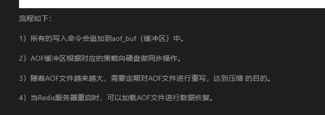
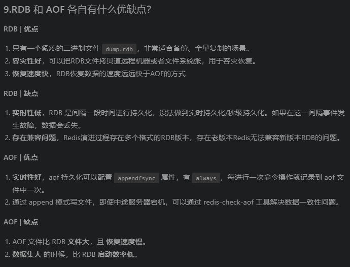

## 4、Redis ##
 - 【参考文档：https://tobebetterjavaer.com/sidebar/sanfene/redis.html#_12-redis-4-0-%E7%9A%84%E6%B7%B7%E5%90%88%E6%8C%81%E4%B9%85%E5%8C%96%E4%BA%86%E8%A7%A3%E5%90%97】
 - 【参考文档：https://javaguide.cn/database/redis/redis-questions-02.html】
### 4.1Redis的数据类型
1. String k/v ：字符串是最基本的数据结构
2. List：列表类型用来存储多个有序的字符串。
3. Set: 集合类型也是用来存储多个字符串元素，但和列表类型不一样的是，集合中不允许有重复的元素，并且集合中的元素是无序的。
4. ZSet有序集合：有序集合中的与元素可以排序。但是它和列表使用索引下标作为排序依据不同的是，他给每个元素设置一个权重（score）作为排序的依据。
5. Hash：哈希类型指的是键值本身又是一个键值对结构

### 4.2  Redis的3种常用的读写策略。
- 1、Cache Aside Pattern 旁路缓存模式
    - 读：
        - 1、从cache种读取数据，如果缓存种有数据的直接返回。
        - 2、cache中读取不到的话，就从db中获取数据返回
        - 3、再把数据放到cache中.
    - 写：
        - 1、先更新DB
        - 2、然后直接删除cache。
    - 旁路缓存模式缺陷：
        - 1. 首次请求的数据在cache中不存在，
        - 2. 写操作比较频繁的话，会导致缓存中的数据频繁被删除，会影响缓存命中率。
    - 解决办法：
        - 数据库强一致性场景：更新db的时候同样更新cache，不过我们需要加一个锁/分布式锁来抱保证更新cache的时候不存在线程安全问题。
        - 可以短暂的允许数据库和缓存不一致的场景：更新DB的时候同时更新cache，但是给换粗加一个比较短的过期时间。

- 2、 Read/Write Through Pattern（读写穿透）
    - 读:
        - 1、从cache中读取数据，如果缓存中存在数据的话直接返回数据
        - 2、如果cache中没有数据的话，先db加载，写入到cache中后返回响应。
    - 写
        - 1、先查cache，cache中不存在，直接更新db。
        - 2、cache中存在，则先更新cache，然后cache服务自己更新DB（同步更新cache和db）。
    - 读写穿透的缺陷：

- 3、Write Behind Pattern（异步缓存写入
    - 这种方式和读写穿透的方式很相似。 两者都是有cache服务来负责cache和db读写。但是两者又有很大的不同，读写穿透是同步更细cache和db，而Write Behind则是只是更新缓，不直接更新DB，而是改为异步批量的方式更新DB

### 4.3 如何保证Redis和数据库的一致性。
1. 更新缓存数据的4种方案。
    - 先更新缓存，再更新数据库
    - 先更数据库，再更新缓存
    - 先淘汰数据，再更新数据库
    - 先更新数据库，再淘汰数据

2. 更新、淘汰数据优缺点。
    - 淘汰数据
        - 优点：操作方式简单。
        - 缺点：淘汰数据后，下一次无法在缓存中查询到，会有一次cache-miss。
    - 更新数据
        - 优点：缓存命中率高，不会造成cache-miss。
        - 缺点：1、 更新cache消耗更大。 2、并发更新到处数据不一致问题。

3. 保持数据一致性的策略。
    1. 延时双删：(1)写请求 (2)删除缓存 (3)更新数据库 (4)休眠一会，再次删除缓存。
    2. 删除缓存重试机制：
        - 写请求更新数据库
        - 缓存因为某些原因删除失败
        - 把删除的Key放入消息队列。
        - 要删除的key拉出来。
        - 重试删除操作。
    3. 读取数据库的binlog日志来异步淘汰缓存。

4. 保证本地缓存和分布式缓存的一致性。
    1. 可以使用Redis本身的Pub/Sub机制，分布式集群的所有节点都订阅删除本地缓存频道。删除Redis的节点，同时发布删除本地缓存消。
    2. 引入专业的消息队列，保证消息的可靠性，但是增加了系统的复杂性。
    3. 设置适当的过期时间兜底，本地缓存可以设置相对短一点的过期时间。

### 4.4 Redis分区方案
1. 节点取余
2. 一致性Hash分区，
3. 虚拟槽分区

### 4.5 Redis集群
1. redis集群的三种模式
    - 1. 主从模式
    1. 集群介绍
        - (1)主从模式里使用一个redis实例作为主机，其余多个实例作为备份机（slave）
        - (2)master用来支持数据的写入和读取操作，而slave节点支持读取以及master的数据同步
        - (3)在整个架构中，master和slave实例里的数据完全一致。
        2. 主从复制原理：
        - 全量同步:
            - 1、当从节点启动时，向主节点发送SYNC消息，
            - 2、主节点收到SYNC命令后，开始在后台执行保存快照的命令生成RDB文件，使用缓冲记录此后执行的所有命令。
            - 3、主节点快照完成后，将快照文件和所有缓存命令发送给集群内的从节点，并在发送期间继续记录被执行的命令。
            - 4、主节点快照发送完成后向从节点发送所缓冲区的命令。
            - 5、从节点载入快照文件后，开始接受命令请求，执行收到的主节点缓冲区的写命令。
            - 增量同步:
                - 主从复制中因为网络原因造成数据丢失的场景，当从节点再次连接主节点。如果条件允许，主节点会补发丢失数据给从节点。因为补发的数据远远小于全量数据，可以有效的避免全量复制的过高开销。
        3. 主节点故障的处理方式：
            - 主从模式中，每个客户端连接redis实例都指定了ip和端口号。如果连接的redis实例因为故障下线了，则无法通知客户端连接其他客户端，因此只能手动操作。
        4. 不支持高可用
    - 2. 哨兵模式
        1. 集群介绍：和主从模式不一样的是，哨兵模式中增加了独立进程（即哨兵）来监控集群的一举一动。客户端在连接集群时，首先连接哨兵，通过哨兵查询主节点的地址，然后再去连接主节点信息进行数据交互。如果master异常，则会进行master-slave切换，将最优的一个slave切换为主节点。同时，哨兵持续监控挂掉的节点，待其恢复后，作为新的节点假如集群中。
        2. 主节点故障处理方式/哨兵工作方式：
            - 1、每个哨兵每秒向集群中的master、slave以及其他哨兵发送一个Ping命令。
        - 2、如果某个实例距离最后一次有效回复ping命令的时间超过一定的值，则会被标记为下线。
        - 3、如果master被标记为主观下线，那么正在监视master的哨兵以每秒的频率确认其确实进入主观下线状态，且数量达到一定值时，master会被标记为下线，然后通知其他的服务器，修改配置文件，让他们切换主机。
        - 4、客户端在master节点发生故障时会向哨兵要地址，此时会获得最新的master节点地址。
        3. 扩容问题：哨兵模式的出现虽然解决了主从模式中master节点宕机不能自动切换的问题(即高可用)的问题。但是，随着业务的逐渐增长，不可避免需要对当前业务进行扩容。
        - 1、垂直扩容：通过增加master来增加容量
        - 2、水平扩容：通过增加节点来进行扩容，即在当前基础上再增加一个master节点。
            - 虽然垂直扩容方式很便捷，不需要添加多余的节点，但是机器的容量是有限的，最终还是需要通过水平扩容方式来解决。而水平扩容涉及到数据的迁移，且迁移过程中又要保证服务的可用性。因此，数据能不迁移，尽量不迁移。
            - 显然哨兵模式无法满足这种情形，因此redis-cluster应运而生。
    - 3. Redis-cluster模式
        1. 集群介绍：
            1. redis-cluster模式采用了无中心节点的方式来实现，每个主节点都会与其他节点保持连接。节点间通过gossip协议交换彼此的信息。同时每个主节点又有一个或者多个从节点。
            2. 客户端连接集群时，直接与redis集群的每个主节点连接，根据hash算法取模key存储在不同的hash槽上。
            3. 在集群中采用数据分片的方式，将redis集群分为16384个哈希槽。 这些哈希槽分别存储于三个主节点中。
                - master1负责 0-5460号哈希槽。
                - master2负责 5461-10922哈希槽。
                - master3负责 10922-16383哈希槽。
            4. 每个节点会保存一份数据分布表，节点将自己的slot信息发送到其他节点，节点间不停地传递数据分布表。
            5. 客户端连接集群时，通过集群的某个节点地址进行连接。客户端尝试向这个节点执行命令时，比如获取某个key值，如果key所在的slot刚好在该节点上，则能够直接执行成功。如果slot不在该节点，则节点返回MOVED错误，同时把该slot对应的节点告诉客户端，客户端可以去该节点执行命令。
        - 2. 主节点故障处理方式：
        1. Redis cluster中主节点故障处理方式与哨兵模式比较相像，当约定的时间内某节点无法与集群中的另一个节点顺利完成Ping消息通信时，则将该节点标记为主观下线状态，同时将这个消息向整个集群广播。如果一个节点收到某个节点失联的数量达到了集群的大多数时，那么将该节点标记为客观下线状态，并向集群广播下线节点fail消息。然后立即对该故障节点进行主从切换、等到原来的节点恢复后，会自动成为新主节点的从节点。如果主节点没有从节点，那么当他发生故障时，集群就将处于不可用状态、
        - 3. 扩容问题：
        1. 当集群中加入新节点时，会与集群中的某个节点进行握手，该节点会把集群内的其他节点信息通过gossip协议发送给新节点，新节点与这些节点完成握手后加入到集群中。 然后集群中的节点会各自取一部分哈希槽分配给新节点。当集群要删除节点时，只需要将节点中的所有哈希槽移动到其他节点，然后再移除空白的节点就可以了。

### 4.6 Redis内存淘汰机制
 - redis内存淘汰机制
    - 1、从设置了过期时间的数据中，选取最少使用的数据淘汰
    - 2、从设置了过期时间的数据中，选取即将过期的数据
    - 3、从设置了过期时间的数据中，随机淘汰数据
    - 4、从所有数据中，淘汰最少使用的数据
    - 5、从所有数据中，随机淘汰数据
    - 6、禁止驱逐数据，当内存不足时，插入新数据直接报错。
 - redis4新增的特性
     - 1、从设置了过期时间的数据中，淘汰最不经常使用的
     - 2、从所有数据中，选取最不经常使用的数据

  -Reds产生的问题
 - 1、缓存穿透
     - 查询根本不存在的数据
     - 解决办法：
        - （1）数据范围
        - eg邮箱格式
        - eg主键不小于0
     - （2）布隆过滤器

- 2、缓存击穿：访问热点数据，但是数据在缓存中不存在。（可能是批量过期了，导致数据库的访问量激增）
    - 解决办法：
    - 热点数据时间比较久，永久不过期
    - 数据预热
    - 请求数据库写缓存之前，先获取互斥锁，保证同一个时间内只有一个请求落到数据库。

 - 3、缓存雪崩 大量的缓存数据失效。

### 4.7Redis为什么这么快？
 - 1、完全基于内存操作。
 - 2、使用单线程，避免了线程切换和竞态产生的小号
 - 3、基于非阻塞的IO多路复用模型
 - 4、C语言实现，优化过的数据结构
 
### 4.8、Redis持久化策略？
 - 分为RDB和ROF两种。、
 - RDB RDB持久化是把当前进程数据生成快照保存到硬盘的过程，触发RDB持久化过程分为手动触发和自动触发。
 - 手动触发两个命令 save和bgsave：
  - save命令：阻塞当前Redis服务器，直到RDB过程完成为止，对于内存比较大的实例会造成长时间阻塞，线上环境不建议使用。
  - bgsave命令：Redis进程执行fork操作创建子进程，RDB持久化过程由子进程负责，完成后自动结束。阻塞只发生在fork阶段，一般时间很短。 
  - 以下场景会执行RDB持久化：
    - 使用save相关配置，如“save m n”。表示m秒内数据集存在n次修改时，自动触发bgsave。
    - 如果从节点执行全量复制操作，主节点自动执行bgsave生成RDB文件并发送给从节点
    - 执行debug reload命令重新加载Redis时，也会自动触发save操作
    - 默认情况下执行shutdown命令时，如果没有开启AOF持久化功能则自动执行bgsave。
 - AOF：  AOF（append only file）持久化：以独立日志的方式记录每次写命令， 重启时再重新执行AOF文件中的命令达到恢复数据的目的。AOF的主要作用是解决了数据持久化的实时性，目前已经是Redis持久化的主流方式。
 - AOF的工作流程操作：命令写入 （append）、文件同步（sync）、文件重写（rewrite）、重启加载 （load） -
  - AOF的流程：
   - 
  -  RDB和AOF的优缺点：
   - 
    
### 4.9、Redis4 混合持久化？
 - 将RDB文件的内容和增量的AOF日志文件放在一起。这里AOF不再是全量的日志，而是自持久化开始到持久化结束的这段时间发生的增量AOF日志，通常这部分的AOF日志很小。

### 4.10 Redis的主从复制了解吗？
 - 主从复制是指将一台Redis服务器的数据复制到其他Redis服务器，前者叫做主节点，后者叫做从节点。且数据的复制是单向的，只能由主节点到从节点。Redis主从复制支持主从同步和从从同步两种。
 - 主从复制的作用？
   - 1、数据冗余：实现了数据的热备份，是持久化之外另一种数据冗余方式
   - 2、故障恢复：当主节点出问题时，可以有从节点提供服务
   - 3、负载均衡：可以有主节点负责写数据，从节点负责读数据，实现服务器的负载均衡
   - 4、高可用基石：除了以上作用，主从复制还是哨兵和集群能够实施的基础。
 - 主从复制的流程？
    - 1、保存主节点信息，这一步只是保存主节点的信息，保存主节点的ip和port。
    - 2、主从建立连接。从节点发现新的主节点后，会尝试和主节点建立网络连接。
    - 3、发送ping命令，连接建立以后从节点发送ping命令请求进行首次通信，主要是检测主从之间网络套接字是否可用、主节点当前是否可以接受处理命令。
    - 4、权限验证 如果主节点要求密码验证。从节点必须发送正确的密码才能通过验证。
    - 5、同步数据集 主从复制连接正常通信后，主节点会把持有的数据全部发送给从节点
    - 6、命令持续复制 接下来主节点持续地把新命令发送给从节点，保持数据一致性。

### 4.11 Redis主从数据同步的方式有哪些？
 - Redis在2.8以上使用psync命令完成主从同步，同步过程分为：全量复制和部分复制。
 - ??

### 4.12 主从复制有哪些问题？
 - 一旦主节点出现故障，需要手动将一个从节点晋升为主节点，同事需要修改应用方的主节点地址，还需要命令其他从节点去复制新的主节点。整个过程需要人工干预
 - 主节点的写能力受单机限制
 - 主节点的存储能力受到单机限制

### 4.13 Redis哨兵模式。
 - 哨兵模式由两个部分组成
   - 哨兵节点：哨兵节点由一个或多个哨兵节点组成，哨兵节点是特殊的Redis节点，不存储数据。对数据节点进行监控
   - 数据节点：主节点和从节点都是数据节点。
 - 在复制的基础上，哨兵模式增加了自动化的故障恢复功能
   - 监控：哨兵节点会不断检查主节点和从节点是否能正常工作。
   - 自动故障转移：当主节点不能正常工作是，哨兵开始自动故障转移操作，它会将失效主节点的其中一个从节点升级为新的主节点，并让其他从节点改为复制新的主节点。
   - 配置提供者：客户端在初始化时，通过哨兵来获取当前redis的主节点信息。
   - 通知：哨兵可以将故障转移的结果发送给客户端。
### 4.14 哨兵模式的原理？
 - 哨兵模式是通过哨兵节点完成对数据节点的监控、下线、故障转移。
 - 定时监控(三个定时任务)：
   - 1、每隔10秒，每个哨兵节点会向主节点发送info命令获取最新的拓扑结构。
   - 2、每隔两秒，每个哨兵节点会向数据节点的_sentinel_:hello频道上发送哨兵节点对于主节点的判断以及当前哨兵节点的信息。
   - 3、每隔1秒，每个哨兵节点会向主节点、从节点和其他哨兵节点发送一条ping命令做一次心跳检测。来确定这些节点是否可达。
 - 主观下线和客观下线
 - 领导者哨兵节点选举：采用Raft算法。
 - 故障转移

### 4.15 Redis集群？
 - 数据分区：数据分区时集群的核心功能。集群将数据分散到多个节点，一方面突破了Redis单机内存大小的限制，存储容量大大增加；另一个方面 每个主节点都可以对外提供读服务和写服务。大大提高了集群的响应能力。
   - 数据分区的三种方式：
     - 1、节点取余分区：
       - 缺点：当节点数量发生变化时。数据节点映射关系需要重新计算。会导致数据的迁移
     - 2、一致性哈希分区
       - 缓存节点在圆盘上分布不均匀，会造成部分缓存节点压力过大
       - 当某个节点故障时，这个节点所要承担的访问会全部落到下一个节点，会对后面的这个节点造成压力
       - 3、虚拟槽分区：这个方案在一致性哈希的基础上，引入虚拟节点的概念。Redis集群使用的便是该方案，其中的虚拟节点称为槽。槽是介于数据和实际节点之间的虚拟概念，每个实际节点包含一定数量的槽，每个槽包含哈希值在一定范围内的数据。
         - 在使用了槽的一致性哈希分区中，槽是数据管理和迁移的基本单位。槽解耦了数据和实际节点之间的关系。增加或者删除节点对系统的影响很小。
 - 高可用：集群支持主从复制和主节点的自动故障转移。当任一节点发生故障时，集群任可以对外提供服务。

### 4.16 Redis集群的原理？
 - Redis集群通过数据分区来实现数据的分布式存储，通过自动故障转移实现高可用。
 - 1、集群创建
   - 数据分区实在集群创建的时候完成的。
   - (1)节点握手：节点握手是指一批运行在集群模式下的节点通过Gossip协议彼此通信，达到感知对方的过程。节点握手是集群彼此通信的第一步，由客户端发起命令 cluster meet{ip}{port}。在完成彼此握手后，一个个的节点就组成了集群。
   - (2)分配槽：Redis集群会把所有的数据映射到16384个槽中。每个节点对应若干个槽
   - (3)故障转移：redis集群的状态转移和哨兵的故障转移类似，但是Redis集群中所有的节点都要承担状态维护的任务。
     - 故障发现是Redis集群内节点通过ping/pong消息实现彼此通信，集群中的每个节点都会定期向其他节点发送ping/pong消息。如果在cluster-node-timeout时间内通信一直失败，则发送节点就会认为接收节点存在故障，把接收节点标记为主观下线。
     - 当某个节点发现一个主观下线节点后，响应的节点状态会跟随消息在集群内传播。通过Gossip协议传播，集群节点不断收集故障节点的下线报告。当半数以上持有槽的主节点都标记某个节点是主观下线时，触发主观下线流程。
   - (4)故障恢复：故障节点变成客观下线后，如果下线节点是持有槽的主节点，则需要在它的从节点中选一个替换他，从而保证集群的高可用。
     - 故障恢复流程：
       - 1、资格审查：每个从节点都要检查最后与主节点的断线时间，判断是否有资格替换故障的主节点，
       - 2、准备选举时间：当从节点符合故障转移资格后，更新触发故障选举的时间，只有达到改时间后才能执行选举流程。
       - 3、发起选举：当从节点定时任务检查达到故障选举时间后，发起选举流程
       - 4、选举投票：持有槽的主节点处理故障选举消息
       - 5、替换主节点

### 4.17 集群的伸缩性？
 - Redis提供了灵活的节点扩容和伸缩方案。可以在不影响集群对外服务的情况下，为集群添加节点进行扩容，也可以下线部分节点进行缩容。
 - 其实集群伸缩的关键点，就在于槽和节点的对应关系，扩容和缩容就是将一部分槽和数据迁移给新节点。

### 4.18 什么事缓存穿透、缓存击穿、缓存雪崩？
 - 1、缓存击穿？
   - 一个并发访问量比较大的key在某个时间过期，导致所有的请求打到了数据库。
   - 解决方案：
     - 1、加锁更新
     - 2、将过期时间组合写在value中，通过异步的方式不断的刷新过期时间，防止此类现象。
 - 2、缓存穿透
   - 查询缓存和数据库都不存在的数据，这样每次请求都会打到数据库上，好像缓存不存在一样
   - 解决方案：
     - 缓存空值/默认值
       - 问题：缓存中存了更多的键值。
       - 缓存和存储层数据不一致，可能对业务有影响
     - 布隆过滤器：除了缓存空值，我们可以在存储和缓存之前,加一个布隆过滤器，做一层过滤
 - 3、缓存雪崩
   - 某一个时刻发生大规模的缓存失效的情况，例如缓存服务宕机、大量key在同一时间过期。这样的后果就是大量的请求进来直接打到DB上，可能导致整个系统的崩溃
   - 解决方案：
     - 提高缓存可用性
       - 集群部署
       - 多级缓存
     - 过期时间
       - 均匀过期
       - 热点数据永不过期
     - 熔断降级
       - 服务熔断：当缓存服务器宕机或者超时时，为了防止整个系统出现雪崩，暂时停止业务服务访问缓存系统
       - 服务降级：当出现大量缓存失效，而且处在高并发负荷的状态下，在业务系统内暂时舍弃对一些非核心的接口和数据的请求，而直接返回一个提前准备好的fallback错误处理信息。

### 4.19布隆过滤器
 - 布隆过滤器，它是一个连续的数据结构，每个存储为都存储了一个bit，即0或1，来标识数据是否存在。
 - 存储数据的时候，使用k个不同的哈希函数将这个变量映射为bit列表的k个点，把他们置为1
 - 我们判断key是否存在的时候，同样k个哈希函数，映射到bit列表上的k个点，判断是不是1
   - 如果有不是1的数，那么key不存在
   - 如果全部是1，也只是表示key可能存在
 - 布隆过滤器的缺点
   - 1、他咋判断元素是否在集合的时候是有一定错误的概率，因为哈希算法有一定碰撞的概率。
   - 2、不支持删除元素。

### 4.20 Redis如何判断缓存数据过期的？ 
 - Redis通过一个叫过期字典（可以看做hash表）来保存数据的过期时间。过期时间的键指向Redis数据库中的某个key，过期字典的值是一个long long类型的整数，这个整数保存了key所指向的数据库键的过期时间

### 4.21 过期数据的删除策略？
 - 1、惰性删除：只会在取出key的时候猜对数据进行定期检查。对cpu友好，造成大量key未被删除
 - 2、定期删除：每隔一段时间抽取一批key执行删除key操作。

### 4.22 Redis内存淘汰机制？
 - redis提供6中内存淘汰机制
   - 1、volatile-lru：从已经设置过期时间的数据中，挑选最少使用的数据过期（其实就是最近使用时间）
   - 2、volatile-ttl：从已经设置过期的数据集中，挑选要过期的数据淘汰
   - 3、volatile-random：从已经设置过期的数据集中，随机挑选数据淘汰
   - 4、allkeys-lru:当内存不足时，在键空间，移除最近最少使用的key（最常用）
   - 5、allkeys-random：从数据集中，选择任意数据淘汰
   - 7、no-evievion：禁止驱除数据，也就是说当内存不足以容纳新数据时，新写入操作会报错。
 - Redis 4.0版本之后增加了一下两种：
   - volatile-lfr：在已经设置了过期时间的数据中，挑选最不经常使用的数据淘汰。
   - allkeys-lfr：当内存不足以容纳写入新数据时，在键空间，移除最不经常使用的数据。